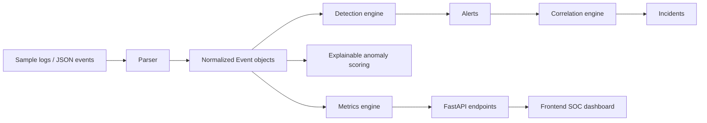

# AI-SIEM — SOC / AI-SIEM Portfolio Project

AI-SIEM is a defensive cybersecurity engineering portfolio project that demonstrates how a small SOC backend can ingest logs, normalize events, run detection logic, correlate alerts, calculate operational metrics, and expose the results through a FastAPI API and lightweight dashboard.

This is **not** a production SIEM and does not claim enterprise readiness. It is designed to show backend engineering, SOC detection engineering, API design, testing discipline, and honest security thinking in a recruiter-readable project.

## Architecture



## Main features

- FastAPI backend with SOC-focused endpoints.
- Bearer-token API authentication with `AI_SIEM_API_KEY`.
- Environment-configured CORS, defaulting to `http://localhost:5173`.
- Ingest limits for request size, log size, and total in-memory events.
- Simple in-memory per-IP rate limiting.
- Audit logging to `logs/audit.log` without logging secrets.
- Parser statistics for unknown/unsupported formats.
- Rule-based detections mapped to MITRE ATT&CK tactics and techniques.
- Alert suppression window to reduce duplicate alerts.
- Correlated incidents with related alert IDs, evidence summaries, and timelines.
- Lightweight statistical anomaly scoring with clear reasons and contributing features.
- Metrics calculated from actual in-memory state, not hardcoded demo numbers.
- Docker Compose support and security CI.

## Security Model

All endpoints except `GET /api/health` require:

```http
Authorization: Bearer <token>
```

Set the key before running the backend:

```bash
export AI_SIEM_API_KEY='dev-token'
```

Example:

```bash
curl -H "Authorization: Bearer $AI_SIEM_API_KEY" http://localhost:8000/api/events
```

The frontend optionally reads the token from browser localStorage:

```js
localStorage.setItem('AI_SIEM_API_KEY', 'dev-token')
```

This localStorage pattern is acceptable for this portfolio lab, but should not be used as-is for a high-security production deployment.

## Rate limits and ingest limits

Defaults:

- Global rate limit: `60` requests/minute per IP via `AI_SIEM_RATE_LIMIT_PER_MINUTE`.
- Ingest rate limit: `10` ingest requests/minute per IP via `AI_SIEM_INGEST_RATE_LIMIT_PER_MINUTE`.
- Max events per ingest request: `100` via `AI_SIEM_MAX_EVENTS_PER_INGEST`.
- Max raw log size per item: `10 KB` via `AI_SIEM_MAX_RAW_LOG_BYTES`.
- Max in-memory events: `10,000` via `AI_SIEM_MAX_IN_MEMORY_EVENTS`.

Limit violations return `413` or `429` with clear error messages.

## Audit logging

Security-relevant events are logged to `logs/audit.log` by default:

- auth failures
- rate-limit failures
- ingest actions
- triage actions
- validation failures

Audit lines include timestamp, client IP, endpoint, action, and result. Full Authorization headers and secrets are not logged.

## API endpoints

| Method | Endpoint | Auth | Purpose |
|---|---|---|---|
| `GET` | `/api/health` | public | Backend status |
| `GET` | `/api/events` | required | Normalized events |
| `GET` | `/api/alerts` | required | Detection alerts |
| `GET` | `/api/incidents` | required | Correlated incidents |
| `GET` | `/api/incidents/{incident_id}` | required | One incident by ID |
| `GET` | `/api/rules` | required | Rule definitions |
| `GET` | `/api/metrics` | required | SOC metrics and parser failure count |
| `GET` | `/api/anomalies` | required | Explainable anomalies |
| `GET` | `/api/parser/stats` | required | Parser visibility stats |
| `GET` | `/api/triage` | required | Recorded triage actions |
| `POST` | `/api/ingest` | required | Ingest events/logs |
| `POST` | `/api/triage` | required | Record analyst triage |

## Detection coverage

| Rule ID | Detection | Severity | MITRE tactic | MITRE technique |
|---|---|---:|---|---|
| `DET-SSH-001` | SSH brute force from one source IP | High | Credential Access | `T1110` |
| `DET-SSH-002` | Successful login after multiple failures | High | Initial Access | `T1078` |
| `DET-PS-001` | Encoded or suspicious PowerShell execution | Critical | Execution | `T1059.001` |
| `DET-NET-001` | Internal port scan across multiple destinations | Medium | Discovery | `T1046` |
| `DET-WIN-001` | Admin account creation or group change | Critical | Persistence | `T1136` |
| `DET-WAF-001` | SQL injection indicators in WAF/web requests | High | Initial Access | `T1190` |
| `DET-AI-001` | Rare source IP for user | Medium | Initial Access | `T1078` |
| `DET-AI-002` | Off-hours privileged access | Medium | Privilege Escalation | `T1078` |

## Run locally

```bash
python -m venv .venv
source .venv/bin/activate  # Windows: .venv\Scripts\activate
pip install -r requirements.txt
export AI_SIEM_API_KEY='dev-token'
uvicorn backend.main:app --reload --host 0.0.0.0 --port 8000
```

Backend: `http://localhost:8000`

Frontend can be opened from `frontend/index.html`. Configure the API URL and token:

```js
localStorage.setItem('AI_SIEM_API', 'http://localhost:8000')
localStorage.setItem('AI_SIEM_API_KEY', 'dev-token')
```

## Run with Docker

```bash
export AI_SIEM_API_KEY='dev-token'
docker compose up --build
```

Docker hardening notes:

- Uses `python:3.11-slim`.
- Runs as a non-root `appuser`.
- Adds `HEALTHCHECK` for `/api/health`.
- Uses `.dockerignore` to keep secrets, Git metadata, logs, venvs, and node modules out of the build context.

## Run tests and security checks

```bash
python -m compileall backend tests
AI_SIEM_API_KEY=test-token AI_SIEM_RATE_LIMIT_PER_MINUTE=1000 AI_SIEM_INGEST_RATE_LIMIT_PER_MINUTE=1000 python -m unittest discover tests -v
bandit -q -r backend -lll
pip-audit -r requirements.txt
```

The CI workflow runs compile checks, unit tests, Bandit, and pip-audit.

## Limitations

- In-memory storage only; data is lost on restart.
- No database persistence.
- No RBAC or multi-user authorization model.
- No production deployment hardening such as TLS termination, secrets manager integration, or distributed rate limiting.
- Parsers are practical examples, not full ECS/OCSF coverage.
- No Sigma rule import/export yet.
- Anomaly detection is explainable/statistical, not enterprise ML.

## Roadmap

- Add SQLite/PostgreSQL persistence.
- Add RBAC and API key management.
- Add ECS/OCSF mapping.
- Add Sigma import/export.
- Add analyst notes and audit trail persistence.
- Add rule suppression/tuning workflow.
