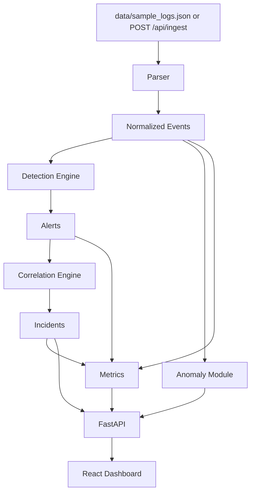

# AI-SIEM — Live SOC Command Center

AI-SIEM is a cybersecurity portfolio project for SOC analyst / junior detection engineering practice. It is not an enterprise SIEM replacement. It demonstrates a realistic mini-pipeline: log ingestion, parsing, normalization, detections, correlation, explainable anomaly scoring, metrics, and a dashboard.

## What the project really does

- Ingests mixed raw logs and already-normalized JSON events.
- Normalizes events into a consistent schema.
- Runs rule-based detections with fields, regex, thresholds, windows, grouping, severity, confidence, and MITRE ATT&CK mapping.
- Correlates alerts into incidents using real relationships, not fake counts.
- Calculates metrics from the current in-memory dataset.
- Generates explainable statistical anomalies.
- Provides a FastAPI backend and React/Vite frontend.

## Architecture



## Normalized event schema

`id`, `timestamp`, `source`, `event_type`, `asset`, `user`, `src_ip`, `dst_ip`, `process_name`, `command_line`, `status`, `message`, `raw_log`.

## API endpoints

- `GET /api/health`
- `GET /api/events`
- `GET /api/alerts`
- `GET /api/incidents`
- `GET /api/incidents/{id}`
- `GET /api/rules`
- `GET /api/metrics`
- `GET /api/anomalies`
- `POST /api/ingest`
- `POST /api/triage`

## Detection examples

| Rule | Logic | MITRE |
|---|---|---|
| SSH brute force | 5 failed SSH logins from same `src_ip` in 5 minutes | T1110 |
| Success after failures | successful SSH login after multiple failures | T1078 |
| Encoded PowerShell | PowerShell command containing encoded/bypass indicators | T1059.001 |
| Internal port scan | same `src_ip` touches many `dst_ip` values quickly | T1046 |
| Admin account creation | Windows admin/account-change event indicators | T1136 |
| SQL injection | WAF/web URI matches SQLi regex indicators | T1190 |
| Off-hours privileged activity | root/admin success outside normal hours | T1078 |
| Rare source IP | successful login from new source for user | T1078 |

## Anomaly examples

The anomaly module is intentionally explainable and lightweight. It uses statistical baselines, not black-box ML:

- event volume per asset
- failed-login volume per user/source IP
- off-hours privileged activity
- rare source IP per user
- unusual process/command usage

Each anomaly includes `anomaly_score`, `reason`, `contributing_features`, related event IDs, and a recommended analyst action.

## Run locally

```bash
pip install -r backend/requirements.txt
uvicorn backend.app.main:app --reload --host 0.0.0.0 --port 8000
```

Frontend:

```bash
cd frontend
npm install
npm run dev
```

## Run tests

```bash
python -m unittest discover tests
```

## Run with Docker

```bash
docker compose up --build
```

Backend: `http://localhost:8000`
Frontend: `http://localhost:5173`

## Configuration

Environment variables:

- `AI_SIEM_HOST`
- `AI_SIEM_PORT`
- `AI_SIEM_ALLOWED_ORIGIN` defaults to `http://localhost:5173`

CORS is not wildcard by default.

## Limitations

- In-memory data only; no database persistence yet.
- Parsers are practical examples, not full ECS/OCSF coverage.
- No authentication/API key layer yet.
- No Sigma import/export yet.
- Anomaly module is statistical/explainable, not a trained enterprise ML model.
- This is a portfolio SOC lab, not production software.

## Roadmap

- Add SQLite/PostgreSQL persistence.
- Add API authentication.
- Add Sigma rule import.
- Add ECS/OCSF mapping.
- Add analyst notes and audit trail.
- Add rule suppression/tuning workflow.
- Add file-upload ingestion UI.
