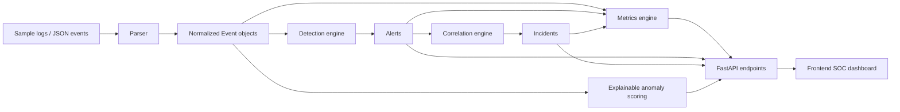

# AI-SIEM — SOC / AI-SIEM Portfolio Project

AI-SIEM is a defensive cybersecurity engineering portfolio project that demonstrates how a small SOC backend can ingest logs, normalize events, run detection logic, correlate alerts, calculate operational metrics, and expose the results through a FastAPI API and lightweight dashboard.

This is **not** a production SIEM and does not claim enterprise readiness. It is designed to show backend engineering, SOC detection engineering, API design, testing discipline, and honest security thinking in a recruiter-readable project.

## Architecture



The backend is intentionally modular:

- `backend/parser.py` normalizes Linux auth, Windows/PowerShell, firewall, WAF, and JSON events.
- `backend/detection.py` applies rule, threshold, time-window, regex, and group-by logic.
- `backend/correlation.py` groups related alerts into incidents.
- `backend/anomaly.py` creates lightweight explainable anomaly findings.
- `backend/metrics.py` calculates dashboard metrics from actual loaded events, alerts, and incidents.
- `backend/main.py` exposes the FastAPI application and API routes.

## Main features

- FastAPI backend with SOC-focused endpoints.
- Safe sample telemetry under `data/sample_logs.json`.
- Normalized event model for mixed log sources.
- Rule-based detections mapped to MITRE ATT&CK tactics and techniques.
- Correlated incidents with related alert IDs, evidence summaries, and timelines.
- Lightweight statistical anomaly scoring with clear reasons and contributing features.
- Metrics calculated from actual in-memory state, not hardcoded demo numbers.
- Frontend dashboard using the current FastAPI response shapes.
- Docker Compose support.
- `unittest` test suite covering parser, detection, correlation, anomaly, metrics, and API behavior.

## API endpoints

| Method | Endpoint | Purpose |
|---|---|---|
| `GET` | `/api/health` | Backend status and loaded event count |
| `GET` | `/api/events` | Normalized events with optional filters |
| `GET` | `/api/alerts` | Alerts produced by detection logic |
| `GET` | `/api/incidents` | Correlated incidents |
| `GET` | `/api/incidents/{incident_id}` | One incident by ID |
| `GET` | `/api/rules` | Detection rule definitions |
| `GET` | `/api/metrics` | SOC metrics and distributions |
| `GET` | `/api/anomalies` | Explainable anomaly findings |
| `GET` | `/api/triage` | Recorded triage actions |
| `POST` | `/api/ingest` | Ingest one event/log or a list of events/logs |
| `POST` | `/api/triage` | Record an analyst triage action |

## Detection coverage

| Rule ID | Detection | Severity | MITRE tactic | MITRE technique |
|---|---|---:|---|---|
| `DET-SSH-001` | SSH brute force from one source IP | High | Credential Access | `T1110` |
| `DET-SSH-002` | Successful login after multiple failures | High | Initial Access | `T1078` |
| `DET-PS-001` | Encoded or suspicious PowerShell execution | Critical | Execution | `T1059.001` |
| `DET-NET-001` | Internal port scan across multiple destinations | Medium | Discovery | `T1046` |
| `DET-WIN-001` | Admin account creation or group change | Critical | Persistence | `T1136` |
| `DET-WAF-001` | SQL injection indicators in WAF/web requests | High | Initial Access | `T1190` |
| `DET-AI-001` | Rare source IP for user | Medium | Initial Access | `T1078` |
| `DET-AI-002` | Off-hours privileged access | Medium | Privilege Escalation | `T1078` |

## Anomaly detection

The anomaly layer is intentionally lightweight and explainable. It is not a black-box ML model. It currently looks for patterns such as:

- High failed-login volume for the same user/source pair.
- Rare source IP for a previously observed user.
- Privileged access outside normal working hours.
- Unusual command usage when a new process appears with suspicious command-line indicators.
- Unusual event volume for a noisy asset.

Each anomaly includes an `anomaly_score`, a human-readable `reason`, `contributing_features`, related event IDs, and a recommended action.

## Run locally

```bash
python -m venv .venv
source .venv/bin/activate  # Windows: .venv\Scripts\activate
pip install -r requirements.txt
uvicorn backend.main:app --reload --host 0.0.0.0 --port 8000
```

Backend: `http://localhost:8000`

Frontend can be opened from `frontend/index.html` or served with any static file server. The frontend uses `http://localhost:8000` by default. To point it somewhere else:

```js
localStorage.setItem('AI_SIEM_API', 'http://localhost:8000')
```

## Run with Docker

```bash
docker compose up --build
```

Backend: `http://localhost:8000`
Frontend: `http://localhost:5173`

## Run tests

```bash
python -m unittest discover tests -v
python -m compileall backend tests
```

The test suite validates:

- FastAPI health, events, metrics, alerts, anomalies, incidents, ingest, and triage endpoints.
- Parser behavior for Linux auth, Windows PowerShell, firewall, WAF, JSON, and invalid logs.
- Detection behavior for brute force, success-after-failure, PowerShell, port scan, SQL injection, and benign events.
- Correlation behavior for related and unrelated alerts.
- Anomaly behavior for failed-login volume, rare source IP, off-hours privileged access, and benign events.
- Metrics behavior for total event count, risk score, and distributions.

## Example ingest request

```bash
curl -X POST http://localhost:8000/api/ingest \
  -H "Content-Type: application/json" \
  -d '{
    "source": "linux_auth",
    "event_type": "ssh_login",
    "asset": "jumpbox01",
    "user": "analyst",
    "src_ip": "192.0.2.50",
    "status": "success",
    "message": "Accepted password for analyst from 192.0.2.50"
  }'
```

The API also accepts a list of events or a wrapper object such as `{ "events": [...] }` or `{ "logs": [...] }`.

## Screenshots

Add screenshots after running the dashboard locally:

- Dashboard overview.
- Alert queue with MITRE mappings.
- Incident lifecycle view.
- Anomaly review view.
- Detection rules view.

Keep screenshots lightweight and avoid committing sensitive data or large binary files.

## Security notes

- No secrets, tokens, real company logs, or credentials are required.
- Sample data is synthetic and safe for public portfolio use.
- Ingestion validates event shape and returns `400` for invalid JSON or invalid event format.
- The backend does not execute shell commands, deserialize unsafe objects, or use `eval`/`exec`.
- CORS is environment-configured and is not wildcard by default.
- Storage is in memory only; restarting the backend reloads sample data.

## Limitations

- In-memory state only; no database persistence yet.
- No authentication, authorization, API keys, or multi-user roles yet.
- Parsers are practical portfolio examples, not full ECS/OCSF/Sigma coverage.
- Incident and alert workflows are simplified for demonstration.
- Anomaly detection is statistical and explainable, not enterprise-grade ML.
- Frontend is a lightweight dashboard, not a complete SOC case-management UI.

## Roadmap

- Add SQLite or PostgreSQL persistence.
- Add API authentication and analyst roles.
- Add Sigma rule import/export.
- Add ECS or OCSF mapping mode.
- Add rule tuning, suppression, and false-positive tracking.
- Add incident notes and immutable audit trail.
- Add report export for incidents and weekly SOC summaries.

## Portfolio positioning

**CV-ready description:** Built a defensive SOC / AI-SIEM portfolio platform using FastAPI that parses mixed security logs, normalizes events, runs MITRE-mapped detection logic, correlates alerts into incidents, generates explainable anomaly findings, calculates live SOC metrics, exposes REST API endpoints, and includes a tested dashboard-compatible backend with Docker and CI validation.
