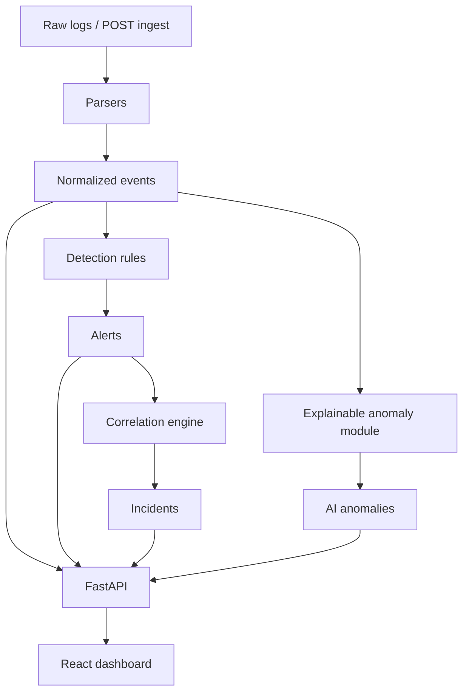

# AI-SIEM — Live SOC Command Center

AI-SIEM is now structured as a credible junior SOC / detection-engineering portfolio project. It is not a production SIEM and it does not pretend to replace Splunk, Elastic, Sentinel, or QRadar.

The goal is practical SOC realism: ingest logs, normalize events, run explainable detections, correlate alerts into incidents, expose API endpoints, and show the result in a dashboard without silently faking live data.

## What was fixed

- Replaced demo-only claims with a real backend SIEM engine.
- Added normalized event schema.
- Added parser layer for Linux auth, Windows / PowerShell, firewall/syslog, and web/WAF style logs.
- Added detection logic with thresholds, windows, severity, MITRE ATT&CK mapping, and confidence.
- Removed fake incident counts and hardcoded related-alert numbers.
- Added correlation by asset, user, source IP, MITRE tactic, and time proximity.
- Added explainable anomaly scoring for failed-login volume, rare source IPs, unusual activity, and off-hours access.
- Added restricted CORS defaults.
- Added tests, CI, Docker, and docker-compose.
- Rewrote documentation to be honest about limitations.

## Architecture



## Normalized event fields

`timestamp`, `source`, `event_type`, `asset`, `user`, `src_ip`, `dst_ip`, `process_name`, `command_line`, `status`, `message`, `raw_log`.

## API endpoints

- `GET /api/health`
- `GET /api/events`
- `GET /api/alerts`
- `GET /api/incidents`
- `GET /api/incidents/{id}`
- `GET /api/rules`
- `GET /api/anomalies`
- `GET /api/metrics`
- `POST /api/ingest`
- `POST /api/triage`

## Detection coverage

| Detection | MITRE tactic | Technique |
|---|---|---|
| SSH brute force | Credential Access | T1110 |
| Successful login after failures | Initial Access | T1078 |
| Encoded PowerShell | Execution | T1059.001 |
| Port / network scan | Discovery | T1046 |
| Admin account creation | Persistence | T1136 |
| SQL injection attempt | Initial Access | T1190 |
| Rare login source | Initial Access | T1078 |
| Off-hours privileged activity | Privilege Escalation | T1078 |

## Quick start

```bash
docker compose up --build
```

Backend: `http://localhost:8000/api/health`

Frontend: `http://localhost:5173`

Run backend tests:

```bash
cd backend
pip install -r requirements.txt
pytest -q
```

## SOC workflow

1. Ingest sample logs or submit logs through `POST /api/ingest`.
2. Parser converts raw lines into normalized events.
3. Detection engine generates alerts.
4. Correlation groups alerts into incidents.
5. AI/anomaly module adds explainable suspicious behavior.
6. Analyst reviews incident evidence, timeline, and recommended actions.
7. Triage endpoint records analyst action.

## Limitations

- In-memory storage only.
- Parsers are practical examples, not exhaustive enterprise parsers.
- AI module is explainable/statistical, not a trained enterprise ML model.
- No authentication yet.
- No database persistence yet.
- No Sigma import yet.

## Roadmap

- Add SQLite/PostgreSQL persistence.
- Add authentication/API keys.
- Add Sigma rule import/export.
- Add ECS/OCSF-compatible schema.
- Add file upload UI.
- Add analyst notes and audit trail.
- Add rule tuning and suppression workflow.
