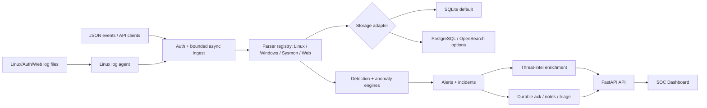

# AI-SIEM — Real SOC / AI-SIEM Portfolio Lab

AI-SIEM is a defensive cybersecurity engineering project that ingests logs, normalizes events, runs detection logic, correlates alerts into incidents, calculates metrics, and exposes the result through a FastAPI API and lightweight SOC dashboard.

The project supports **real local log ingestion**, bounded async processing, Windows Event Log/Sysmon normalization, safe Sigma import/export, optional threat-intelligence enrichment, and durable SQLite persistence. It can bootstrap with bundled sample logs for first-run demo purposes, while new ingested events and analyst state survive backend restarts when SQLite is selected.

This is still not a hyperscale enterprise SIEM replacement. It is a serious defensive engineering foundation and portfolio lab that demonstrates SOC platform architecture, backend engineering, parser design, detection engineering, API security, durable analyst workflows, and operational thinking. The enterprise target architecture and staged roadmap are documented in [`docs/enterprise-roadmap.md`](docs/enterprise-roadmap.md).

## Architecture


```mermaid
flowchart LR
    A[Linux/Auth/Web log files] --> B[Linux log agent]
    C[JSON events / API clients] --> D[Auth + bounded async ingest]
    B --> D
    D --> E[Parser registry: Linux / Windows / Sysmon / Web]
    E --> F{Storage adapter}
    F --> G[SQLite default]
    F --> H[PostgreSQL / OpenSearch options]
    E --> I[Detection + anomaly engines]
    I --> J[Alerts + incidents]
    J --> K[Threat-intel enrichment]
    J --> L[Durable ack / notes / triage]
    K --> M[FastAPI API]
    L --> M
    M --> N[SOC Dashboard]
```

## Main features

- FastAPI backend with SOC-focused endpoints.
- Bearer-token authentication with controlled legacy `AI_SIEM_API_KEY` support, configurable multi-tenant principals/RBAC, and optional JWT mode with issuer/audience/expiry/signature validation.
- CORS support for the dashboard, including browser preflight requests.
- SQLite event persistence in `data/ai_siem.db` by default, plus memory, PostgreSQL, and OpenSearch adapter options.
- Real log tailing agent for Linux auth logs and web access logs.
- Ingest limits for request size, log size, and total loaded events.
- Thread-safe, bounded in-memory per-IP rate limiting; proxy headers are ignored unless `AI_SIEM_TRUST_PROXY_HEADERS=true`.
- Request IDs on API responses and audit records.
- Bounded pagination on event, alert, incident, anomaly, and triage list endpoints using `limit` and `offset`.
- SQLite WAL mode, busy timeout, durable triage, alert acknowledgement, and analyst notes.
- Audit logging to `logs/audit.log` with control-character escaping and without logging secrets.
- Parser statistics for unknown/unsupported formats.
- Rule-based detections mapped to MITRE ATT&CK tactics and techniques.
- MITRE ATT&CK coverage summary for implemented rule metadata.
- Alert suppression and AI-noise reduction for internal rare-source-IP events.
- Correlated incidents with related alert IDs, evidence summaries, and timelines.
- Lightweight statistical anomaly scoring with clear reasons and contributing features.
- Non-root Docker image, Render/Fly deployment templates, health check, and CI definitions for container build/smoke verification.
- Windows Event Log IDs `4624`, `4625`, `4688`, `4104`, `4720`, `4732` and Sysmon normalization.
- Safe Sigma YAML import/export with bounded schema validation and deterministic metadata mapping.
- Opt-in AbuseIPDB/OTX enrichment with IP validation, fixed provider URLs, timeout, cache, and graceful provider failure.

## Security model

All endpoints except `GET /api/health` require:

```http
Authorization: Bearer <token>
```

For local development, the legacy single-admin token remains supported:

```bash
export AI_SIEM_API_KEY='dev-token'
```

For multi-tenant deployments, use explicit principal configuration instead of sharing one token. The value below is an example only; inject real secrets through the deployment secret manager and never commit them:

```bash
export AI_SIEM_PRINCIPALS='{"token-for-tenant-a":{"principal_id":"soc-a","tenant_id":"tenant-a","roles":["analyst","ingestor"]},"reader-token-a":{"principal_id":"reader-a","tenant_id":"tenant-a","roles":["reader"]}}'
```

Supported roles are `admin`, `reader`, `analyst`, `responder`, and `ingestor`; JWT `viewer` is mapped to read-only behavior. Every authenticated request has a principal and tenant context. Events, alerts, incidents, metrics, storage statistics, ingestion batches, acknowledgements, notes, and triage records are filtered by the authenticated tenant; clients cannot select another tenant through a query parameter. Ingestion requires `admin` or `ingestor`; triage, threat-intel enrichment, alert acknowledgement, and analyst notes require `admin`, `analyst`, or `responder`. Use `GET /api/me` to inspect the current principal context.

For migration deployments, use `AI_SIEM_AUTH_MODE=hybrid` or `jwt`. JWT mode requires `AI_SIEM_JWT_SECRET`, `AI_SIEM_JWT_ISSUER`, and `AI_SIEM_JWT_AUDIENCE`; it rejects legacy tokens. The current verifier intentionally supports HS256 only and is a migration foundation, not a substitute for enterprise OIDC/OAuth2.


Fish shell:

```fish
set -x AI_SIEM_API_KEY dev-token
```

Example:

```bash
curl -H "Authorization: Bearer dev-token" "http://localhost:8000/api/events?limit=100&offset=0"
```

For a reverse-proxy deployment, only enable `AI_SIEM_TRUST_PROXY_HEADERS=true` when the application is behind a trusted proxy that overwrites `X-Forwarded-For`. Otherwise the service uses the direct socket peer address.

The frontend reads the token from browser localStorage:

```js
localStorage.setItem('AI_SIEM_API', 'http://localhost:8000')
localStorage.setItem('AI_SIEM_API_KEY', 'dev-token')
```

For WSL-to-Windows browser access, set `AI_SIEM_API` to your WSL IP, for example:

```js
localStorage.setItem('AI_SIEM_API', 'http://172.30.9.161:8000')
```

## Run backend locally

```bash
python -m venv .venv
source .venv/bin/activate
pip install -r requirements.txt
export AI_SIEM_API_KEY='dev-token'
uvicorn backend.main:app --reload --host 0.0.0.0 --port 8000
```

Fish shell:

```fish
source .venv/bin/activate.fish
set -x AI_SIEM_API_KEY dev-token
uvicorn backend.main:app --reload --host 0.0.0.0 --port 8000
```

Health check:

```bash
curl http://localhost:8000/api/health
```

Storage stats:

```bash
curl -H "Authorization: Bearer dev-token" http://localhost:8000/api/storage/stats
```

ATT&CK coverage summary:

```bash
curl -H "Authorization: Bearer dev-token" http://localhost:8000/api/coverage/attack
```

## Run frontend

```bash
cd frontend
python -m http.server 5173
```

Open:

```text
http://localhost:5173
```

Then configure localStorage from browser DevTools Console:

```js
localStorage.setItem('AI_SIEM_API', 'http://localhost:8000')
localStorage.setItem('AI_SIEM_API_KEY', 'dev-token')
location.reload()
```

## Real log ingestion

Start the backend first, then run the agent.

Linux auth logs:

```bash
python agents/linux_log_agent.py \
  --file /var/log/auth.log \
  --api http://localhost:8000 \
  --token dev-token
```

Kali/RHEL/Fedora-style auth logs:

```bash
python agents/linux_log_agent.py \
  --file /var/log/secure \
  --api http://localhost:8000 \
  --token dev-token
```

Web access logs:

```bash
python agents/linux_log_agent.py \
  --file /var/log/nginx/access.log \
  --file /var/log/apache2/access.log \
  --api http://localhost:8000 \
  --token dev-token
```

To ingest an existing lab log file from the beginning:

```bash
python agents/linux_log_agent.py \
  --file ./lab/auth.log \
  --from-start \
  --api http://localhost:8000 \
  --token dev-token
```

The agent stores offsets in `.agent_state/linux_offsets.json` so it does not resend the same lines every run.

## Manual real-event test

You can also send one real-looking log line directly:

```bash
curl -X POST http://localhost:8000/api/ingest \
  -H "Authorization: Bearer dev-token" \
  -H "Content-Type: application/json" \
  -d '{"logs":["Jun 12 14:40:00 kali sshd[1234]: Failed password for invalid user root from 203.0.113.10 port 45678 ssh2"]}'
```

Then refresh the dashboard and check Events, Alerts, Metrics, and Storage stats.

## API endpoints

| Method | Endpoint | Auth | Purpose |
|---|---|---|---|
| `GET` | `/api/health` | public | Backend status |
| `GET` | `/api/events` | required | Normalized events |
| `GET` | `/api/alerts` | required | Detection alerts |
| `GET` | `/api/incidents` | required | Correlated incidents |
| `GET` | `/api/incidents/{incident_id}` | required | One incident by ID |
| `GET` | `/api/rules` | required | Rule definitions |
| `GET` | `/api/coverage/attack` | required | MITRE ATT&CK coverage by rule metadata |
| `GET` | `/api/metrics` | required | SOC metrics and parser failure count |
| `GET` | `/api/anomalies` | required | Explainable anomalies |
| `GET` | `/api/parser/stats` | required | Parser visibility stats |
| `GET` | `/api/storage/stats` | required | SQLite storage statistics |
| `POST` | `/api/ingest` | required | Ingest events/logs |
| `POST` | `/api/triage` | required + analyst/responder/admin | Record analyst triage. |
| `GET` | `/api/me` | required | Return principal, tenant, and roles for the authenticated token. |
| `GET` | `/api/ingest/batches` | required | Tenant-scoped ingestion lifecycle history. |
| `GET` | `/api/alerts/acknowledgements` | required | Tenant-scoped alert acknowledgement records. |
| `POST` | `/api/alerts/{alert_id}/acknowledge` | required + analyst/responder/admin | Acknowledge or unacknowledge one alert with bounded comment. |
| `GET` | `/api/alerts/{alert_id}/notes` | required | Tenant-scoped notes for one alert. |
| `POST` | `/api/alerts/{alert_id}/notes` | required + analyst/responder/admin | Persist one bounded analyst note. |
| `GET` | `/api/threat-intel/status` | required | Provider configuration status without secrets. |
| `POST` | `/api/threat-intel/enrich` | required + analyst/responder/admin | Opt-in global-IP enrichment through configured providers. |
| `GET` | `/api/rules/sigma` | required | Export detection rules as YAML. |
| `POST` | `/api/rules/sigma/import` | required + admin | Safely import bounded Sigma YAML rules. |

## Detection coverage

| Rule ID | Detection | Severity | MITRE tactic | MITRE technique |
|---|---|---:|---|---|
| `DET-SSH-001` | SSH brute force from one source IP | High | Credential Access | `T1110` |
| `DET-SSH-002` | Successful login after multiple failures | High | Initial Access | `T1078` |
| `DET-SSH-003` | SSH password spraying across multiple users from one source IP | High | Credential Access | `T1110.003` |
| `DET-PS-001` | Encoded or suspicious PowerShell execution | Critical | Execution | `T1059.001` |
| `DET-NET-001` | Internal port scan across multiple destinations | Medium | Discovery | `T1046` |
| `DET-WIN-001` | Admin account creation or group change | Critical | Persistence | `T1136` |
| `DET-WAF-001` | SQL injection indicators in WAF/web requests | High | Initial Access | `T1190` |
| `DET-AI-001` | Rare external source IP for user | Medium | Initial Access | `T1078` |
| `DET-AI-002` | Off-hours privileged access | Medium | Privilege Escalation | `T1078` |

## MITRE ATT&CK coverage report

`GET /api/coverage/attack` summarizes implemented detection-rule metadata by ATT&CK tactic and technique. It is useful for SOC roadmap work because it shows where the current rule set is concentrated and where coverage is still thin.

The report is intentionally honest: it reflects implemented rule metadata only. It does not prove that every required telemetry source is connected, that every ATT&CK procedure is detected, or that rules are tuned for a production environment.

Example fields:

```json
{
  "total_rules": 7,
  "tactics": [{"tactic": "Initial Access", "rule_count": 2}],
  "techniques": [{"technique": "T1078", "tactic": "Initial Access", "rule_count": 1, "rules": ["DET-SSH-002"]}],
  "unmapped_rules": []
}
```

## Run tests and security checks

```bash
python -m compileall backend tests agents
AI_SIEM_API_KEY=test-token AI_SIEM_RATE_LIMIT_PER_MINUTE=1000 AI_SIEM_INGEST_RATE_LIMIT_PER_MINUTE=1000 python -m unittest discover tests -v
bandit -q -r backend agents -lll
pip-audit -r requirements.txt
```

## Docker and deployment

```bash
docker build --pull -t ai-siem:local .
docker run --rm -p 8000:8000 \
  -e AI_SIEM_AUTH_MODE=legacy \
  -e AI_SIEM_API_KEY='dev-token' \
  -e AI_SIEM_ALLOWED_ORIGIN='http://localhost:5173' \
  ai-siem:local
```

The image uses Python 3.12 slim, runs as a non-root user, includes a `/api/health` health check, and keeps secrets/Git metadata/logs out of the build context. Render and Fly.io manifests are provided in `render.yaml` and `fly.toml`; they are templates and require platform-side secret configuration and a verified deployment. Read [`docs/deployment.md`](docs/deployment.md) before deploying.

## Current limitations

- SQLite remains the default and is appropriate for a single-process demo or controlled lab, not distributed production SIEM scale; PostgreSQL/OpenSearch adapters are optional and require their own dependencies, credentials, backups, and operational testing.
- Legacy tokens remain available for controlled migration, while production identity should use OIDC/OAuth2, short-lived credentials, asymmetric signing, rotation, revocation, and centralized policy.
- The Docker build and health smoke test are defined in CI, but the current sandbox does not provide a Docker daemon; no external live deployment URL is claimed.
- Windows/Sysmon parsing covers the requested IDs but is not full ECS/OCSF coverage.
- Sigma importer supports a deliberately bounded single-selection subset and rejects unsupported constructs.
- Threat-intel enrichment is opt-in and advisory; provider failures or stale data must not be treated as proof of benignness or maliciousness.
- Anomaly detection is explainable/statistical, not enterprise ML; automatic containment remains intentionally unimplemented.

## Roadmap

The next priority is streaming ingestion with collector registration, retries, dead-letter queues, replay, and measured backpressure. Later releases should add enterprise OIDC, key rotation, PostgreSQL/OpenSearch production validation, data retention, case management, approval-gated response, disaster recovery, and a retrieval-grounded AI analyst layer. See [`docs/enterprise-roadmap.md`](docs/enterprise-roadmap.md) and [`docs/deployment.md`](docs/deployment.md).
