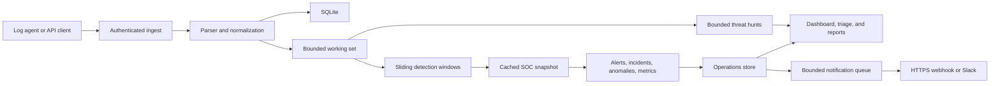

# AI-SIEM Architecture

AI-SIEM is designed as a lightweight full-stack SOC/SIEM platform.

## Components

- **Frontend**: static HTML/CSS/JavaScript dashboard.
- **Frontend gateway**: Nginx static hosting and same-origin `/api/` proxy in Docker.
- **Backend**: FastAPI HTTP API with authentication, rate limiting, and audit logging.
- **Data Layer**: SQLite event, triage, alert, incident, SLA, and history persistence plus a bounded in-memory analysis set.
- **Notification dispatcher**: bounded background delivery to explicitly configured generic or Slack HTTPS webhooks.
- **Report builder**: aggregate summaries and bounded de-identified JSON/CSV evidence export.
- **Threat hunt engine**: structured literal search, bounded recent-event scope, facets, shared safe event serialization, role-gated raw mode, and backpressured off-thread execution.
- **Detection Content**: typed detection metadata mapped to MITRE ATT&CK.
- **Parsers**: source-specific parser metadata.
- **Dashboards**: dashboard metadata definitions.
- **Workflows**: response playbooks.

## Data Flow

## API Flow

The frontend fetches backend endpoints every 15 seconds and updates the SOC
dashboard. API values are HTML-escaped before template rendering, and the API
key lives only in the current browser tab.

Detection evaluation uses per-rule sliding windows instead of rescanning all
previous events for every event. Alerts, incidents, anomalies, and metrics are
then cached together until ingestion changes the event generation.

High-severity alert creation and first-time SLA breaches enqueue de-identified
notifications without waiting for the destination. The dispatcher refuses
redirects and applies bounded timeouts, retries, debounce, and circuit breaking.

Report summaries contain aggregate posture only. Evidence records are bounded
and de-identified before serialization; Operators can export the safe form,
while raw targets require an explicit Admin request. The readiness endpoint
reports only component state and safe counts.

Threat hunts operate on a capped copy of the most recent active telemetry.
Queries arrive as structured POST bodies, use literal and allowlisted exact
matching only, and return bounded facets and results. Viewer responses and
search omit raw logs; Operators may explicitly enable capped raw matching and
preview. The event list reuses the same safe representation. Hunt evaluation
runs off the async loop behind a bounded semaphore, so saturation rejects
excess work quickly instead of starving routine endpoints. Safe audit metadata
deliberately excludes the analyst's literal terms and entity values.

## Design Goal

The goal is to demonstrate practical SOC engineering skills without requiring a complex stack.
