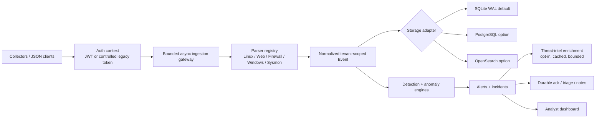

# AI-SIEM Architecture

AI-SIEM is a defensive SOC/SIEM platform foundation. The current implementation is a single FastAPI process with bounded asynchronous ingestion, tenant-aware authorization, deterministic detections, explainable anomaly scoring, durable analyst state, and replaceable storage adapters. It is suitable for a lab, controlled demo, and incremental enterprise engineering; it is not yet a hyperscale distributed SIEM.

## Components

| Component | Current implementation | Enterprise direction |
|---|---|---|
| Dashboard | Static HTML/CSS/JavaScript dashboard with tenant/principal context and ingestion batch ledger. | SSO-backed analyst UI, case search, evidence export, and approval workflows. |
| Identity | Legacy token compatibility, configurable principals/RBAC, and optional HS256 JWT mode with `iss`, `aud`, `exp`, `nbf`, and algorithm validation. | OIDC/OAuth2, asymmetric key rotation, revocation, centralized policy, and short-lived credentials. |
| Ingestion | Bounded `/api/ingest`, `asyncio.to_thread` parsing/persistence, batch ledger, backpressure limits, and parser statistics. | Collector registry, durable queue, retry, dead-letter queue, replay, and backpressure across workers. |
| Parsers | Linux auth, web/firewall, Windows Event Log, and Sysmon normalization with bounded fields and event-ID metadata. | Parser registry with OCSF/ECS-aligned schema and source-specific validation. |
| Detection | Deterministic rules mapped to MITRE ATT&CK plus explainable statistical anomalies. | Versioned rule lifecycle, scheduled evaluation, suppression, entity baselines, and evaluated AI assistance. |
| Threat intelligence | Opt-in AbuseIPDB/OTX enrichment with fixed HTTPS endpoints, global-IP filtering, timeout, bounded cache, and failure fallback. | Provider policy, tenant quotas, asynchronous enrichment workers, provenance, and retention policy. |
| Storage | SQLite WAL default, memory test backend, optional PostgreSQL and OpenSearch adapters, all with tenant-scoped reads. | PostgreSQL/lakehouse durable source of truth plus OpenSearch-derived search index and measured failover. |
| Analyst state | Durable triage, alert acknowledgement, and append-only analyst notes with request/principal metadata. | Case management, evidence chain, retention, export, and approval-gated response execution. |
| Deployment | Non-root Docker image, Render Blueprint, Fly.io manifest, health check, and CI smoke-test definitions. | Platform-managed secrets, protected CI/CD, backups, observability, autoscaling, and restore drills. |

## Current Data Flow

## Security Boundaries

All routes except `GET /api/health` require authentication. Tenant scope is taken from the authenticated principal and is never accepted as a client-selected query parameter. Write operations for ingestion, triage, acknowledgement, notes, Sigma import, and threat-intel enrichment are role-protected. Raw provider secrets are read from environment variables and are not returned or written to audit details. Input sizes, query pagination, parser fields, provider responses, note text, and audit fields are bounded.

JWT mode accepts only HS256 with an explicit configured secret and validates issuer, audience, expiry, not-before, issued-at, token type, subject, tenant, and roles. This is a migration foundation, not a replacement for enterprise OIDC/OAuth2 with asymmetric keys, rotation, revocation, and centralized identity policy.

## Deployment Boundary

SQLite is the default and is appropriate for a single-process demo or controlled lab. PostgreSQL and OpenSearch adapters are optional and fail closed when their dependencies or connection settings are absent. The Dockerfile runs as a non-root user and exposes `/api/health` for readiness. `render.yaml` and `fly.toml` are deployment templates only; they do not prove that an external service is deployed. See [`deployment.md`](deployment.md) for platform configuration and verification.

## Verification Contract

Every feature handoff must include regression tests, Bandit, `pip-audit`, `git diff --check`, a fresh clone install/run, and a health smoke test. Docker build and container smoke execution are defined in CI, but the local sandbox used for this branch does not provide a Docker daemon; that limitation is recorded rather than hidden.

## Design Goal

The implementation should improve enterprise readiness without overstating current guarantees. The target architecture, staged release gates, and AI safety guardrails are documented in [`enterprise-roadmap.md`](enterprise-roadmap.md).
